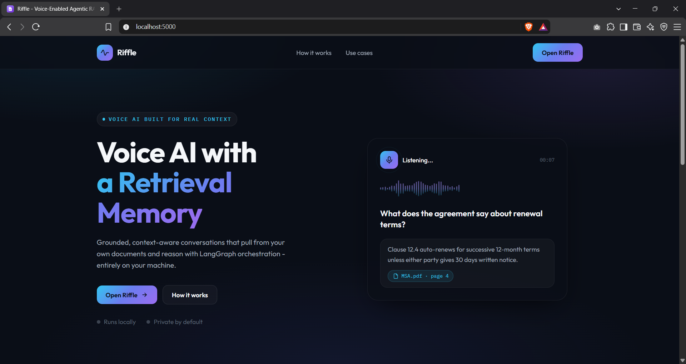
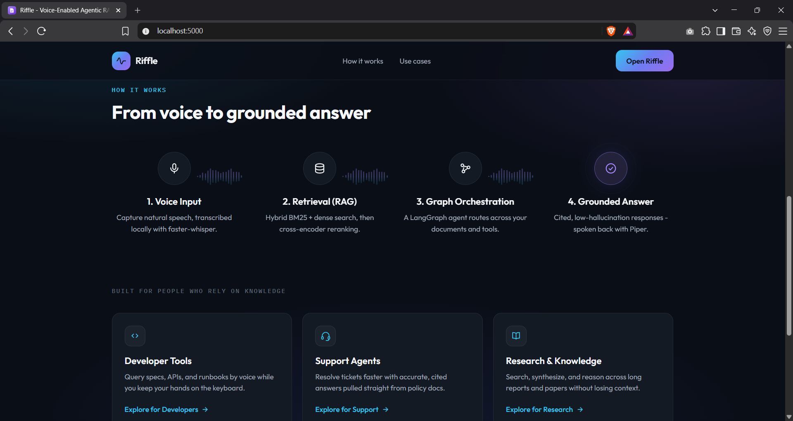
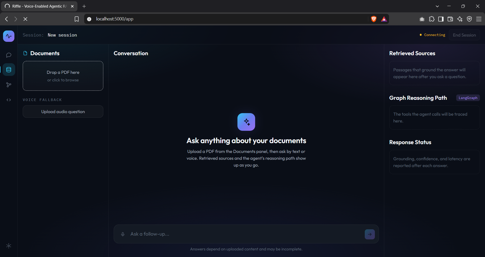
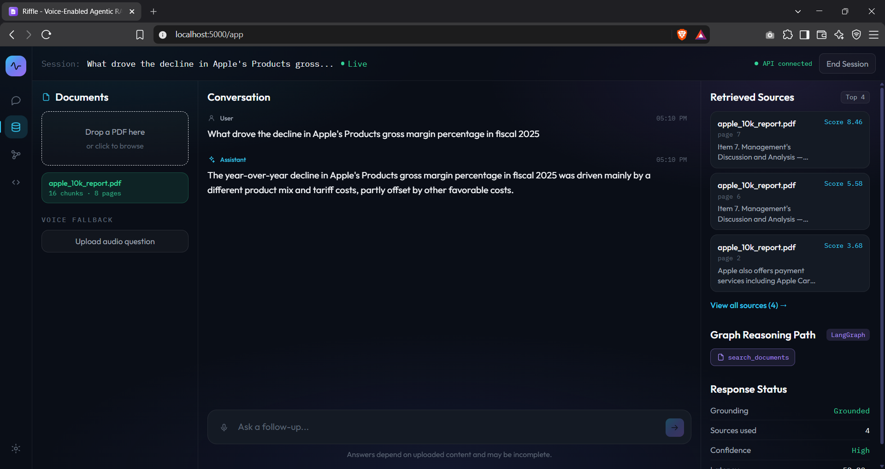
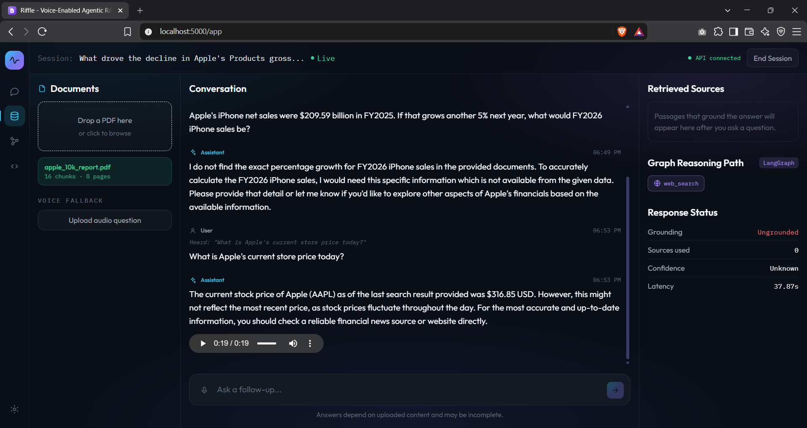
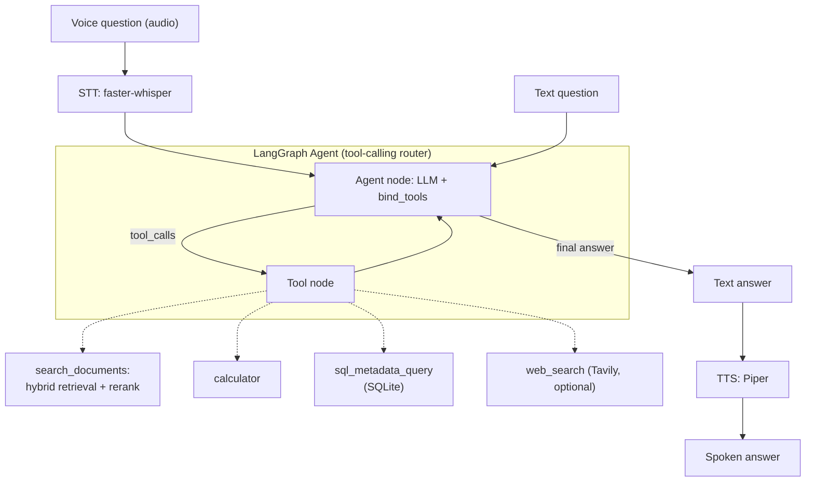

# Riffle - Voice-Enabled Agentic RAG Assistant

Private-document RAG over PDFs, upgraded from a plain text chatbot into a
**voice-enabled, agentic** assistant that runs entirely on local models.

- Ask by text or by voice; hear the answer spoken back.
- Hybrid retrieval (BM25 + dense) with cross-encoder reranking for grounded,
  low-hallucination answers.
- A LangGraph agent that decides between searching your documents, doing math,
  querying document metadata, or (optionally) searching the web.
- Measured quality with RAGAS; optional LangSmith tracing.
- Nothing leaves your machine (Ollama + local embeddings + local speech).

## Screenshots

Landing page and the workspace at `http://localhost:5000`.











## Architecture



See [docs/ARCHITECTURE.md](docs/ARCHITECTURE.md) for detailed pipeline diagrams
(ingestion, retrieval + rerank, agent routing, voice, evaluation).

## Stack

| Layer      | Technology                                                            |
| ---------- | --------------------------------------------------------------------- |
| API        | FastAPI + Uvicorn (`app.py`)                                          |
| UI         | Vite + React + TypeScript + Tailwind (`web/`), Outfit + IBM Plex Mono |
| LLM        | Ollama (OpenAI-compatible), default `qwen2.5:3b`                      |
| Embeddings | `BAAI/bge-small-en-v1.5` (sentence-transformers)                      |
| Chunking   | Semantic chunking (fallback: recursive)                               |
| Retrieval  | Hybrid BM25 + Chroma dense via `EnsembleRetriever`                    |
| Reranking  | Cross-encoder `ms-marco-MiniLM-L-6-v2`                                |
| Agent      | LangGraph tool-calling agent                                          |
| Tools      | document search, calculator, SQL metadata, web search (Tavily)        |
| Voice      | faster-whisper (STT) + Piper (TTS)                                    |
| Evaluation | RAGAS (local judge) + optional LangSmith                              |
| Deploy     | Docker Compose (API + Ollama; React UI served by FastAPI)             |

## Setup

```bash
cd RAG_proj
python -m venv .venv
# Windows
.venv\Scripts\activate
# macOS/Linux: source .venv/bin/activate

pip install -r requirements.txt
```

Start Ollama (required for answers) and pull a tool-capable model:

```bash
ollama serve
ollama pull qwen2.5:3b
```

Copy `.env.example` to `.env` to override defaults (model, embeddings, weights,
voice, web search, tracing).

## Run the UI

The UI is a Vite + React SPA in `web/`. Build it once and FastAPI serves it, so
the whole app runs as a single process:

```bash
cd web
npm install
npm run build
cd ..
uvicorn app:app --host 0.0.0.0 --port 5000
```

Open http://localhost:5000 for the landing page; **Open Riffle** launches the
workspace at `/app`. Upload a PDF, then ask by text or with the mic button. The
right-hand panels show the retrieved sources with rerank scores, the LangGraph
tool path the agent actually took, and per-answer metrics.

For frontend development with hot reload, run Vite alongside the API. The dev
server proxies API paths to port 5000, so no extra config is needed:

```bash
# terminal 1
uvicorn app:app --port 5000
# terminal 2
cd web && npm run dev          # http://localhost:5173
```

## Run the API

```bash
uvicorn app:app --host 0.0.0.0 --port 5000
# or: python app.py
```

Interactive docs at http://localhost:5000/docs.

| Method | Path          | Body                           |
| ------ | ------------- | ------------------------------ |
| GET    | `/health`     | -                              |
| GET    | `/corpus`     | -                              |
| POST   | `/reset`      | -                              |
| POST   | `/ingest`     | multipart field `file` (PDF)   |
| POST   | `/chat`       | JSON `{ "message": "..." }`    |
| POST   | `/voice-chat` | multipart field `file` (audio) |

`/chat` and `/voice-chat` always return how the answer was reached (what the
workspace panels render):

```jsonc
{
  "answer": "...",
  "sources": [
    {
      "title": "report.pdf",
      "location": "page 4",
      "snippet": "...",
      "score": 6.49,
    }, // cross-encoder rerank score
  ],
  "tool_path": ["search_documents", "calculator"], // tools the agent called
  "metrics": {
    "grounded": true, // document search ran and returned passages
    "sources_used": 4,
    "confidence": "High", // heuristic from the top rerank score
    "latency_s": 1.32,
  },
}
```

## Offline ingest CLI

```bash
python ingest.py path/to/document.pdf
```

## Retrieval quality: evaluation with RAGAS

Generate the sample corpus (5 PDFs, including distractor SKUs) and run the
headline eval. Ollama must be running:

```bash
python scripts/make_sample_docs.py     # writes sample PDFs to data/eval/docs/
python -m src.evaluation                # held-out RAGAS + retrieval ablation
# python -m src.evaluation --all        # also scores the easy extractive quiz
# python -m src.evaluation --ablation   # source hit rates only (no judge LLM)
```

The **held-out** set (`data/eval/qa_heldout.json`) uses paraphrase, near-duplicate
products (SunMax 370 / PowerCell 15), multi-hop, and unanswerable questions so
keyword overlap is not enough. The extractive quiz in `qa_dataset.json` is a
smoke test only.

RAGAS measures **faithfulness**, **answer relevancy**, **context precision**,
and **context recall** with a local judge. A separate ablation table reports
top-1 / top-k **source hit rate** for BM25, dense, hybrid, and hybrid+rerank
on the same held-out questions (no LLM). Results: [docs/eval_results.md](docs/eval_results.md).

Latest held-out RAGAS (`qwen2.5:3b` generator + judge, 20 items):

| Metric            | Score (0–1) |
| ----------------- | ----------- |
| faithfulness      | 0.688       |
| answer_relevancy  | 0.675       |
| context_precision | 0.729       |
| context_recall    | 0.750       |

Latest retrieval ablation (16 answerable held-out questions):

| Setup              | Top-1 hit | Top-4 source recall |
| ------------------ | --------: | ------------------: |
| BM25 only          |     0.562 |               0.938 |
| Dense only         |     0.875 |               1.000 |
| Hybrid (no rerank) |     0.688 |               1.000 |
| Hybrid + rerank    |     0.875 |               1.000 |

## Optional: web search

Set `TAVILY_API_KEY` (free tier at tavily.com) to enable the `web_search` tool.
When unset, the tool is not registered and the agent stays documents-first.

## Optional: LangSmith tracing

```bash
export LANGCHAIN_TRACING_V2=true
export LANGCHAIN_API_KEY=ls-...
export LANGCHAIN_PROJECT=riffle
```

The app warns (but does not fail) if tracing is enabled without a key.

## Docker

Runs the React UI (built in a Node stage and served by FastAPI) and Ollama
together. Inside Compose the LLM URL is `http://ollama:11434/v1`.

```bash
docker compose up --build
```

First start pulls `qwen2.5:3b` via the `ollama-init` service (can take several
minutes). Piper voices and Whisper/embedding models are cached in the mounted
`./data` and `hf_cache` volumes.

| Service            | URL                    |
| ------------------ | ---------------------- |
| React UI + FastAPI | http://localhost:5000  |
| Ollama             | http://localhost:11434 |

```bash
docker compose down
```

## Project layout

```
app.py                 FastAPI API (/health /corpus /reset /ingest /chat /voice-chat) + serves web/dist
ingest.py              CLI ingest
web/                   Vite + React + TS + Tailwind UI
  src/pages/           Landing (marketing) + Workspace (chat)
  src/components/      Shared UI, landing/ and workspace/ sections
  src/lib/api.ts       Typed client for the FastAPI endpoints
scripts/
  make_sample_docs.py  Generate sample eval PDFs (dev)
  run_eval.py          Held-out RAGAS + retrieval ablation
  run_retrieval_ablation.py  Source hit-rate ablation only
  demo_agentic_query.py Multi-tool agent demo
src/
  config.py            Central configuration (env-driven)
  embeddings.py        Shared bge embedding provider
  ingest.py            PDF load + semantic/recursive chunking
  retrieval.py         Hybrid BM25 + dense ensemble
  reranker.py          Cross-encoder reranking
  rag.py               RAG chain + agent routing
  llm.py               Ollama chat client
  metadata.py          SQLite document-metadata store
  session.py           Corpus reset helpers
  evaluation.py        RAGAS harness
  voice/
    stt.py             faster-whisper speech-to-text
    tts.py             Piper text-to-speech
  agent/
    graph.py           LangGraph tool-calling agent
    tools/             search_documents, calculator, sql_metadata, web_search
data/
  raw/                 uploaded PDFs
  chroma/              vector store
  eval/                sample PDFs + qa_dataset.json (smoke) + qa_heldout.json
  voice/               downloaded Piper voices (gitignored)
```
