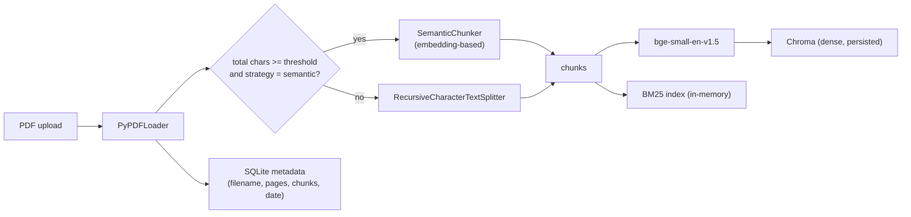
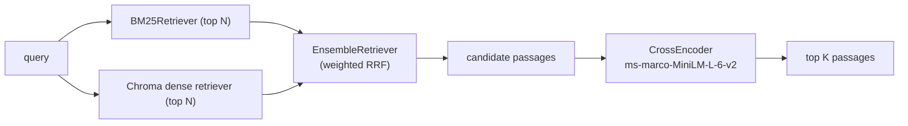
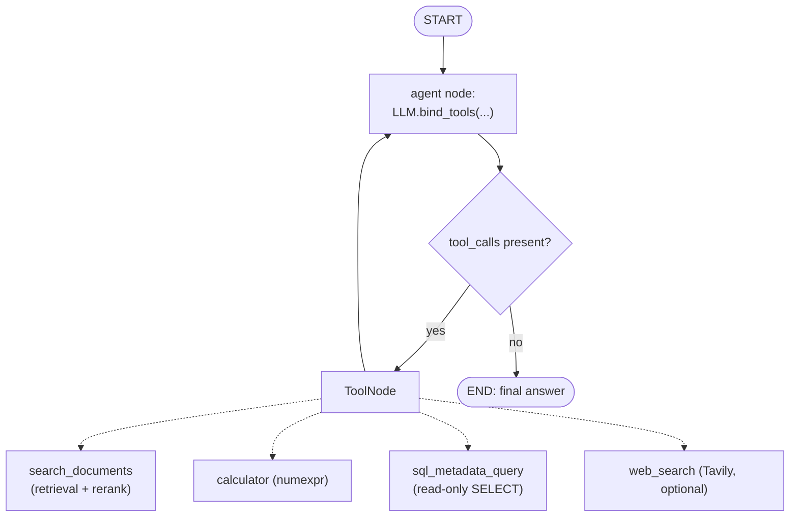
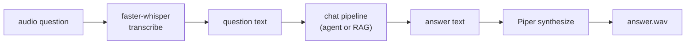
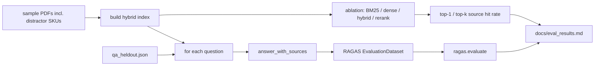

# Riffle Architecture

Riffle is a voice-enabled, agentic RAG assistant that runs on local models. This
document details each pipeline. All components run locally: the LLM via Ollama,
embeddings and reranking via sentence-transformers, and speech via
faster-whisper and Piper.

## Components

| Module | Responsibility |
|--------|----------------|
| `src/config.py` | Central, env-driven configuration |
| `src/embeddings.py` | Cached `bge-small-en-v1.5` embedding provider |
| `src/ingest.py` | PDF loading + semantic/recursive chunking |
| `src/retrieval.py` | Hybrid BM25 + dense ensemble index and retrieval |
| `src/reranker.py` | Cross-encoder reranking of candidates |
| `src/rag.py` | RAG chain + routing into the agent |
| `src/metadata.py` | SQLite store of ingested-document metadata |
| `src/agent/graph.py` | LangGraph tool-calling agent |
| `src/agent/tools/*` | search_documents, calculator, sql_metadata, web_search |
| `src/voice/stt.py` | faster-whisper speech-to-text |
| `src/voice/tts.py` | Piper text-to-speech |
| `src/evaluation.py` | RAGAS evaluation harness |
| `app.py` | FastAPI service (+ serves the React SPA) |

## 1. Ingestion pipeline

When a PDF is uploaded, it is loaded, chunked, embedded into Chroma, indexed for
BM25, and recorded in the metadata store.



Notes:
- Re-ingesting replaces the vector collection (single active document), while
  the metadata store accumulates a row per document ever ingested.
- Semantic chunking falls back to recursive splitting on error or for very
  short documents (`SEMANTIC_MIN_CHARS`).

## 2. Retrieval + reranking pipeline



- First stage casts a wide net (`RETRIEVE_TOP_N`) combining sparse keyword
  matching (BM25) and dense semantic similarity (bge) via reciprocal-rank
  fusion.
- The cross-encoder rescoring stage jointly scores each `(query, passage)` pair
  and keeps the best `RETRIEVER_K`, sharply improving precision and grounding.

## 3. Agent routing pipeline

The LangGraph agent is the router: the LLM decides, via tool-calling, how to
answer. A `ToolNode` executes requested tools and loops back until the model
emits a final answer.



- The system prompt instructs a documents-first strategy: prefer
  `search_documents`, use `calculator` for math, `sql_metadata_query` for facts
  about the ingested corpus, and `web_search` only as a fallback.
- `web_search` is registered only when `TAVILY_API_KEY` is set.
- `sql_metadata_query` accepts a single read-only `SELECT` against the
  `documents` table; writes and multi-statements are rejected.
- Set `AGENT_ENABLED=false` to bypass the agent and use the plain RAG chain.

## 4. Voice pipeline



- Exposed as `POST /voice-chat` (returns transcript, answer text, base64 WAV,
  sources, tool path, and metrics). The React workspace records via the browser
  mic or file upload and plays the spoken answer inline.
- Whisper model size (`STT_MODEL_SIZE`) and Piper voice (`TTS_VOICE`) are
  configurable; voices are downloaded on first use into `data/voice/`.

## 5. Evaluation pipeline

Two Q&A sets share the sample GreenLeaf PDFs. The extractive quiz
(`qa_dataset.json`) is a smoke test. The held-out set (`qa_heldout.json`) adds
paraphrase, SKU distractors, multi-hop, and unanswerable items. Retrieval
ablation measures source hit rate across BM25 / dense / hybrid / rerank
without a judge LLM.



Metrics: faithfulness, answer relevancy, context precision, context recall, plus
retrieval hit rates. The judge is a local Ollama model (`EVAL_LLM_MODEL`). Latest
numbers: [eval_results.md](eval_results.md) (2026-08-28 held-out: faithfulness
0.688, answer relevancy 0.675, context precision 0.729, context recall 0.750).

## Configuration reference

All configuration is environment-driven (see `.env.example`). Key variables:

| Variable | Default | Purpose |
|----------|---------|---------|
| `LLAMA_MODEL` | `qwen2.5:3b` | Chat/agent model (must support tool-calling) |
| `EVAL_LLM_MODEL` | = `LLAMA_MODEL` | RAGAS judge model |
| `EMBEDDING_MODEL` | `BAAI/bge-small-en-v1.5` | Embeddings |
| `CHUNKING_STRATEGY` | `semantic` | `semantic` or `recursive` |
| `RETRIEVER_K` | `4` | Passages passed to the LLM |
| `RETRIEVE_TOP_N` | `12` | Candidate pool before reranking |
| `BM25_WEIGHT` / `DENSE_WEIGHT` | `0.5` / `0.5` | Hybrid weights |
| `RERANK_ENABLED` | `true` | Toggle cross-encoder reranking |
| `AGENT_ENABLED` | `true` | Route through the LangGraph agent |
| `TAVILY_API_KEY` | (empty) | Enables the web_search tool |
| `STT_MODEL_SIZE` | `base` | Whisper size |
| `TTS_VOICE` | `en_US-lessac-medium` | Piper voice |
| `LANGCHAIN_TRACING_V2` | `false` | Enable LangSmith tracing |
```
